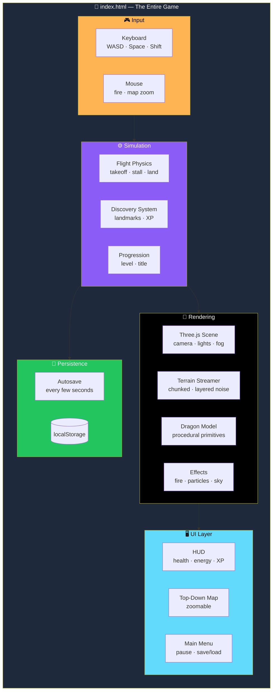
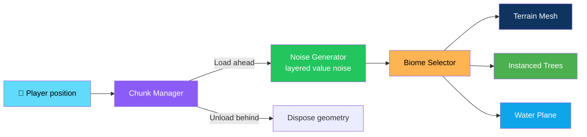
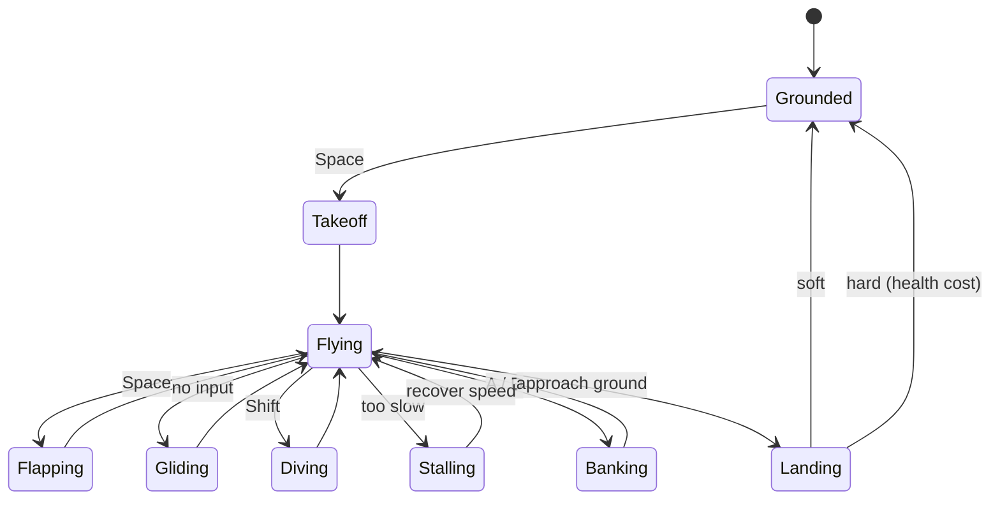

# 🐉 Dragonflight: Open World

<div align="center">


**A browser-based 3D dragon flight game built with Three.js.**

*Single self-contained HTML file — no build step, no install, no server required.*

[🎮 Run It](#-run-it) • [⌨️ Controls](#-controls) • [✨ What's Implemented](#-whats-implemented) • [🏗️ Architecture](#️-architecture) • [🔮 Extending It](#-extending-it)

</div>

---

## 📖 Overview

**Dragonflight: Open World** is a browser-based 3D dragon flight game built with **Three.js**.

### Core Idea

> **One file. No build. No install. No server.**
>
> Everything — rendering, terrain generation, the dragon model, physics, UI, and the save system — lives inside `index.html`. That's deliberate: it makes the game **trivially portable**.

---

## 🎮 Run It

**Double-click `index.html`**, or open it in your browser with **File → Open**.

It also runs fine served from any static web server if you prefer that.

> ⚠️ **Requires a browser with WebGL** — any recent **Chrome**, **Firefox**, **Safari**, or **Edge**.

---

## ⌨️ Controls

| Key | Action |
|-----|--------|
| **W / S** | Move forward / back · pitch up / down while flying |
| **A / D** | Turn left / right |
| **Space** | Take off · flap wings |
| **Shift** | Run *(on ground)* · dive *(in air)* |
| **Left Mouse** | Breathe fire |
| **R** | Roar |
| **1–7** | Change dragon colour |
| **M** | Toggle map *(scroll wheel to zoom)* |
| **V** | Toggle first-person / third-person camera |
| **Esc** | Pause menu |

---

## ✨ What's Implemented

<div align="center">

| 🐉 Dragon Model | ✈️ Flight Physics |
|:---:|:---:|
| Procedurally built from primitives — horned head, jaw with teeth, membrane wings, segmented tail, four legs | Takeoff · flapping · gliding · diving · stalling · banking turns · landing *(hard landings cost health)* |
| **🌍 World** | **🌦️ Sky** |
| Infinite streamed terrain · layered noise · 5 biomes · instanced trees · water plane you can land on and swim in | Dynamic day/night cycle · sun · moon · stars · drifting clouds at multiple altitudes · distance fog |
| **🎥 Camera** | **🔥 Fire Breath** |
| Third-person chase camera · pulls back and widens FOV with speed · first-person mode · screen shake on attacks and hard landings | Particle stream with glow · heat-colored fade · light source · energy bar with cooldown |
| **🧭 Discovery System** | **📈 Progression** |
| Procedurally placed glowing landmarks with generated names · flying into one triggers a "Location Found" banner and grants XP | Level and title · **Young → Experienced → Powerful → Ancient → Legendary Dragon** · driven by XP from discoveries |
| **🗺️ Map** | **💾 Save / Load** |
| Top-down rendered terrain map · your heading · discovered landmarks · zoomable | Autosaves every few seconds to `localStorage` · main menu offers **Continue** and **New Game** |
| **🔊 Audio** | **🎨 Customization** |
| Synthesized wind *(volume tied to airspeed)* · fire crackle · roar sound · **no external audio files** | 7 dragon colours via `1–7` |

</div>

### Detailed Feature List

#### 🐉 Dragon Model

**Procedurally built from primitives:**

- Horned head
- Jaw with teeth
- Membrane wings
- Segmented tail
- Four legs

> 💡 **No external model files.**

#### ✈️ Flight Physics

- Takeoff
- Flapping
- Gliding
- Diving
- **Stalling**
- **Banking turns**
- Landing — **hard landings cost health**

#### 🌍 World

- **Infinite terrain streamed in chunks around the player** — generated from layered noise
- **Biomes:**
  - Ocean
  - Desert
  - Grassland
  - Forest
  - Snowy peaks
- **Instanced trees**
- **Water plane you can land on and swim in**

#### 🌦️ Sky

- **Dynamic day/night cycle** — sun, moon, stars
- **Drifting clouds at multiple altitudes**
- **Distance fog**

#### 🎥 Camera

| Mode | Behavior |
|------|----------|
| **Third-person chase** | Pulls back and widens FOV with speed |
| **First-person** | Immersive flight view |
| **Screen shake** | On attacks and hard landings |

#### 🔥 Fire Breath

- Particle stream with glow
- Heat-colored fade
- A light source
- **Energy bar with cooldown**

#### 🧭 Discovery System

- **Procedurally placed glowing landmarks** with generated names
- Flying into one triggers a **"Location Found"** banner
- Grants **XP**

#### 📈 Progression

**Level and title driven by XP from discoveries:**

```
Young → Experienced → Powerful → Ancient → Legendary Dragon
```

#### 🗺️ Map

- **Top-down rendered terrain map**
- Your heading
- Discovered landmarks
- **Zoomable** via scroll wheel

#### 💾 Save / Load

- **Autosaves every few seconds** to the browser's local storage
- Main menu offers **Continue** and **New Game**

#### 🔊 Audio

- **Synthesized wind** — volume tied to airspeed
- **Fire crackle**
- **Roar sound**

> 💡 **No external audio files.**

---

## 🚫 What's Not Implemented

> **This is Phase 1–2 of the original spec** *(dragon, flight, and world)*, **plus the fire-breath and discovery pieces of Phase 3.**
>
> **The following are NOT built, and there is no placeholder pretending otherwise:**

| Feature | Status |
|---------|:------:|
| Villages, cities, and NPCs with routines or reactions | ❌ |
| Quests | ❌ |
| Enemies, wildlife, and other dragons | ❌ |
| Weather — rain, storms, snowfall | ❌ |
| Fire igniting vegetation or damaging enemies *(visual only right now)* | ❌ |
| Dragon nest / customization beyond color | ❌ |
| Treasure system | ❌ |
| Music and recorded sound effects *(audio is synthesized in-browser)* | ❌ |

> ⚠️ **We'd rather list what isn't there than ship a fake button.**

---

## 🏗️ Architecture

### Everything in One File — By Design



### World Streaming — Infinite Terrain in Chunks



### Flight Physics — State Flow



### Project Structure

```
Dragonflight_Open_World/
├── index.html      # entire game: markup, styles, and all JS in one file
└── README.md        # this file
```

> 💡 **Everything — rendering, terrain generation, dragon model, physics, UI, save system — lives in `index.html`.**
>
> It's kept as one file so it's **trivially portable**; if the project grows further *(villages, NPCs, quests)*, **it should be split into modules at that point.**

### Design Principles

<div align="center">

| Principle | Implementation |
|-----------|---------------|
| **📄 One file, zero dependencies** | The whole game is `index.html` — portable, shareable, and no build step |
| **🎨 Procedural everything** | Dragon model, terrain, trees, landmarks, and audio are all generated at runtime — no external assets |
| **🌍 Streamed world** | Infinite terrain via chunked loading/unloading around the player |
| **📊 Layered noise drives biomes** | Ocean, desert, grassland, forest, and snowy peaks emerge from the same noise function |
| **⏱️ Autosave without friction** | Every few seconds, silently, to `localStorage` |
| **🚫 No fake features** | Nothing pretends to exist. If it's not built, it's listed in **What's Not Implemented** |
| **📦 No external audio** | Wind, fire, and roar are all synthesized in the browser |

</div>

---

## 🔮 Extending It

> **Natural next steps, in the order the original spec recommends.**

### 1. 🏘️ Villages & Cities

- Place structures the **same way landmarks are placed** — procedural placement keyed off world coordinates
- Add **simple NPC meshes**

### 2. 📜 Quests

- A small **state machine** triggered by proximity to specific landmarks or NPCs

### 3. ⚔️ Enemies & Wildlife

- **Reuse the instancing pattern** used for trees for simple animated actors
- Add basic **pursue / flee AI**

### 4. 🌧️ Weather

- A **global state** *(like the day/night cycle)* driving:
  - Fog density
  - A rain particle system
  - Audio filter changes

---

## ⚠️ Known Limitations

<div align="center">

| Limitation | Details |
|-----------|---------|
| **Value noise, not full Perlin/Simplex** | Fast, but **slightly more grid-aligned at extreme zoom-out** — fine at play scale |
| **No LOD on distant chunks** | Very old or low-power GPUs may see reduced framerate with many chunks loaded |
| **Save data is per-browser** | `localStorage` only — **not synced across devices** |

</div>

---

## 🗺️ Roadmap

### ✅ Current

- [x] Procedural dragon model — horned head, jaw, membrane wings, tail, four legs
- [x] Flight physics — takeoff, flapping, gliding, diving, stalling, banking, landing
- [x] Hard landings cost health
- [x] Infinite streamed terrain with layered noise
- [x] Five biomes — ocean, desert, grassland, forest, snowy peaks
- [x] Instanced trees
- [x] Water plane you can land on and swim in
- [x] Dynamic day/night cycle — sun, moon, stars
- [x] Drifting clouds at multiple altitudes
- [x] Distance fog
- [x] Third-person chase camera with speed-based FOV
- [x] First-person mode
- [x] Screen shake on attacks and hard landings
- [x] Fire breath with particles, glow, light, and energy bar
- [x] Discovery system with procedurally placed glowing landmarks
- [x] "Location Found" banner and XP reward
- [x] Progression from Young → Legendary Dragon
- [x] Zoomable top-down map with heading and discoveries
- [x] Autosave to `localStorage` every few seconds
- [x] Main menu with Continue and New Game
- [x] Synthesized wind, fire crackle, and roar
- [x] Seven dragon colours
- [x] Single-file, zero-dependency, no build step

### 🔜 Future Ideas

- [ ] Villages and cities with NPCs
- [ ] Quest system
- [ ] Enemies, wildlife, and rival dragons
- [ ] Weather — rain, storms, snowfall
- [ ] Fire damage to vegetation and enemies
- [ ] Dragon nest and customization
- [ ] Treasure system
- [ ] Music and recorded SFX
- [ ] **Module split** — once the file grows past a comfortable size
- [ ] **Terrain LOD** — for smoother performance on low-end GPUs

---

## 🤝 Contributing

Contributions are welcome. Please:

1. Fork the repository
2. **Keep it single-file** — no external build step or bundler
3. **Keep it asset-free** — no image files, no audio files
4. **Preserve the streaming pattern** — chunk loading and disposal must stay balanced
5. **Don't add fake features** — list what's not built rather than ship a placeholder
6. Test in a WebGL-capable browser
7. Submit a Pull Request

### Guidelines

- **Never add a required external dependency** beyond Three.js
- **Never require a build step** — `index.html` and nothing else
- **Never ship copyrighted assets** — everything is generated in code
- **Never break the autosave** — the game should survive a refresh
- **Never pretend a stub is a feature** — the **What's Not Implemented** section is the standard

---

## 📜 License

MIT — see [LICENSE](LICENSE) for details.

---

## 🙏 Acknowledgments

- **Three.js** — for making procedural 3D worlds this approachable
- **Web Audio API** — for a game with zero audio files
- **Every open-world game that ever made you want to fly** — this one's for you

---

<div align="center">

### 🐉 TAKE OFF. EXPLORE. DISCOVER. GROW.

**One file. No build. No install. No server.**

**Procedural everything — from the dragon to the world to the sound.**

<br>

⭐ If you enjoyed this flight, consider giving it a star.

<br>

[⬆ Back to Top](#-dragonflight-open-world)

</div>
